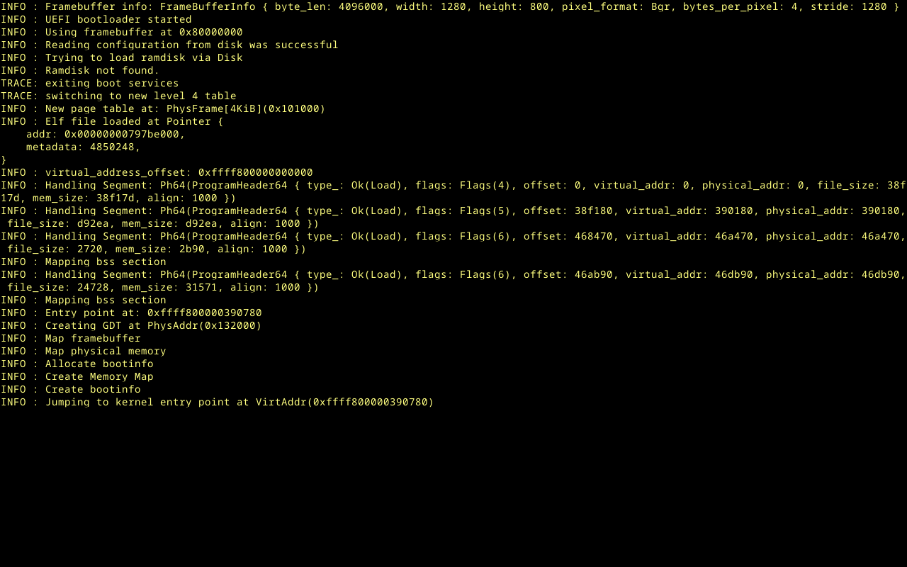

# NexaCore OS

> An AI-native operating system. Local-first, privacy-by-construction, decentralized by design.

[](https://github.com/CySalazar/nexacore-os/actions/workflows/ci.yml)
[](https://github.com/CySalazar/nexacore-os/actions/workflows/qemu-boot-smoke.yml)
[](./LICENSE)
[](https://github.com/CySalazar/nexacore-os/releases)
[](https://github.com/CySalazar/nexacore-os/discussions)

**Status:** Phase 1→2 — a bare-metal Rust microkernel with a working userspace OS on top. **Kernel:** MB1–MB14 cycle closed (per-process CR3, IPC, live INIT-SIPI SMP, TLB shootdown, x2APIC), plus per-device IOMMU (VT-d + AMD-Vi), PCI ECAM scan, and S4 hibernate + device suspend/resume. **Networking:** full userspace dual-stack TCP/IP, TLS 1.3, SSH-2. **Storage:** native NCFS (on-disk v3) + read-only FAT/ext4/NTFS. **AI:** real `no_std` CPU inference (GGUF + BPE + transformer) and a five-agent framework. **Desktop:** userspace compositor/WM with native apps (terminal shell, text editor, file manager, media/image/PDF viewers). **Drivers:** NVMe / virtio-net / e1000e host cores live on Proxmox. **86 crate packages, ~7,700 tests, a 96-entry kernel syscall surface (ABI v2 frozen at 70).**

NexaCore OS reimagines the operating system around AI as a first-class citizen. Inference, model orchestration, and intelligent agents are built into the kernel and runtime — not bolted on as cloud services. Privacy is enforced cryptographically, not by policy. The system can leverage other NexaCore OS instances as a peer-to-peer compute mesh, scaling computational power collectively without depending on commercial AI providers.

---

## Vision

A globally adopted operating system that gives users the full power of modern AI without surrendering their data to centralized providers. Built for a generational lifetime (25+ years), targeting mainstream adoption.

## Core principles

1. **Local-first** — by default, nothing leaves the device.
2. **Privacy by construction** — the protocol enforces privacy cryptographically; trust is not granted, it is mathematically required.
3. **Decentralization as a means** — to achieve privacy and resist capture, not as an end in itself.
4. **Hardware-rooted security** — TEE attestation is mandatory for mesh participation.
5. **Open evolution** — protocol-compliant forks are first-class citizens.

## Documentation

All technical documentation lives in [`/docs`](./docs/README.md). Highlights:

- [Vision and principles](./docs/01-vision.md)
- [Architecture overview](./docs/02-architecture.md)
- [Mesh protocol](./docs/03-mesh-protocol.md)
- [Security model](./docs/04-security-model.md)
- [Governance](./docs/05-governance.md)
- [Roadmap](./docs/06-roadmap.md)
- [Hardware requirements](./docs/07-hardware-requirements.md)
- [Funding policy](./docs/08-funding-policy.md)
- [Tech specifications](./docs/09-tech-specifications.md)
- [Glossary](./docs/10-glossary.md)
- [Tooling & CI](./docs/11-tooling-and-ci.md)
- [Brand & visual identity](./docs/12-brand.md) — pointer to the [`/brand/`](./brand/) pack (strategy, voice, logos, palette, typography, icons, templates, [brand book PDF](./brand/NexaCore-Brand-Book-v0.1.pdf))

## Project policies

- [Security policy & responsible disclosure](./SECURITY.md)
- [Contributing guide](./CONTRIBUTING.md) — DCO sign-off, Conventional Commits, PR workflow
- [Code of Conduct](./CODE_OF_CONDUCT.md) — Contributor Covenant v2.1
- [Commercial support &amp; certification program](./COMMERCIAL-LICENSE.md) — placeholder pending legal-entity setup

## Quick facts

| | |
|---|---|
| **Language** | Rust (2024 edition) |
| **Architecture** | Custom microkernel, written from scratch |
| **Initial hardware** | x86_64 with Intel TDX or AMD SEV-SNP |
| **Model architecture** | Mixture of Experts (MoE) |
| **License** | Apache-2.0 ([LICENSE](LICENSE)) |
| **Governance** | 3-layer: cryptographic protocol / federated specification / legal entity (form under evaluation) |

## Boot it in QEMU

You don't need real hardware to watch NexaCore OS boot. On an **x86-64 Linux host** with a Rust toolchain:

```bash
# Prerequisites: QEMU + OVMF (UEFI firmware) — Debian/Ubuntu:
sudo apt-get install -y qemu-system-x86 ovmf

# Build the kernel-runner, wrap it in a UEFI disk image, boot it, assert the banner:
bash scripts/qemu-boot-smoke.sh
```

This is the **same script CI runs on every push** (the [`qemu-boot-smoke`](./.github/workflows/qemu-boot-smoke.yml) workflow): it builds the `kernel-runner` ELF for `x86_64-unknown-none`, produces a UEFI image, boots it under QEMU+OVMF, and checks the canonical boot banner. The first run materializes the pinned toolchains (`rust-toolchain.toml`). For the graphical desktop smoke, real-hardware bring-up, and troubleshooting, see [`docs/user/src/installation.md`](./docs/user/src/installation.md) and [`kernel-runner/README.md`](./kernel-runner/README.md).

## Public commitments

These are commitments the project makes in writing, in versioned files under `main`, with
signed commits — not in marketing copy that can be quietly walked back.

- **BDFL veto window: 2026-05-09 → 2031-05-09 (immutable sunset, 23:59 UTC).** During this
  5-year window the founder can *block* `Standards Track` NCIPs that break Layer 1 cryptographic
  guarantees, but cannot *impose* any NCIP. The veto cannot be applied to `Process`,
  `Informational`, or `Meta` NCIPs, and cannot be applied to a `Meta` NCIP that narrows the
  founder's own authority. By that asymmetric clause, the window is **structurally
  non-extensible by founder action alone**: extending it requires a `Meta` NCIP that itself
  cannot be vetoed and must pass the full quadratic-vote process. Authoritative source:
  [`NCIP-Process-001` §5.4](./oips/oip-process-001.md). Cross-referenced in
  [`docs/05-governance.md`](./docs/05-governance.md) and the first commit on `main` (`61426d5`,
  signed).

- **NCIPs are public domain (CC0-1.0).** The codebase is Apache-2.0; the *protocol specifications*
  are released into the public domain so they can be quoted, mirrored, translated, and
  re-implemented without permission. Authoritative source:
  [`NCIP-Process-001` §10](./oips/oip-process-001.md).

## Status

> **Graphical desktop demo — running on real hardware (VirtualBox + OVMF, 2026-05-16).**
> The kernel boots bare-metal via UEFI, renders a full interactive desktop (4 windows, live clock,
> PS/2 mouse + keyboard, terminal echo, system info), and powers off cleanly via ACPI S5.
> Physical-memory management, 4-level page-table walker, and IDT exception handlers are operational.



NexaCore OS has closed **Phase 1 (Microkernel PoC)** and is deep into **Phase 2**: the microkernel boots bare-metal, drivers run in Ring 3, a full userspace network + storage + AI-runtime + desktop stack sits on top, and the whole thing runs on QEMU and on Proxmox. The table below is a snapshot; [`docs/02-architecture.md`](./docs/02-architecture.md) has the per-crate breakdown.

| Layer | Crates | State |
|---|---|---|
| Foundational | `nexacore-types`, `nexacore-crypto`, `nexacore-capability` | **Implemented** — `no_std + alloc`, RFC/KAT vectors per primitive, postcard canonical wire. Crypto composes the RustCrypto family plus post-quantum ML-DSA-65 / ML-KEM-768; still `AWAITING_CRYPTO_REVIEW`. Capabilities are Macaroons-style (attenuable, Ed25519, TTL, revocation). |
| **Kernel** | `nexacore-kernel` | **Implemented (~74k LOC).** MB1–MB14 cycle closed (paging, IDT, SYSCALL/SYSRET, ELF64 loader, scheduler, Ring 3 + per-process CR3, IPC/pipes/fds, MP boot with live INIT-SIPI, TLB shootdown, x2APIC, cross-CPU context switch). Plus per-device IOMMU (VT-d + AMD-Vi), PCI ECAM scan, MSI-X, S4 hibernate + device PM, and the Track-A desktop stack (GOP framebuffer, fonts, cursor, PS/2 + USB HID tablet, WM). |
| Drivers (user-space) | `nexacore-driver-{nvme,net-virtio,e1000e,wifi,ahci,tpm,audio,gpu,shared}` (+ bootable `*-image` siblings) | **Host cores implemented; hardware execution in the `*-image` siblings.** Full `NCIP-013` syscall set (`MmioMap`/`DmaMap`/`IrqAttach`/`DriverLoad`) wired end-to-end with a kernel CSPRNG, Ed25519 capability issuer, and a 32 KiB read-only token deposit window. NVMe / virtio-net / e1000e are live on Proxmox; `-ahci` is the least complete (byte-layout core only). |
| Networking | `nexacore-net`, `nexacore-tls`, `nexacore-ssh`, `nexacore-mesh` | **Implemented** (mesh partial). Full userspace dual-stack TCP/IP (ARP, IPv4/IPv6, ICMP, UDP, RFC-793 TCP, DNS, DHCP, NDP/SLAAC, conntrack, firewall), TLS 1.3 client+server, SSH-2 (kex/auth/channels, NexaCore AEAD profile). `nexacore-mesh` has real discovery + handshake + cluster trust; transport/routing are Phase-4 stubs. |
| Storage | `nexacore-fs`, `nexacore-fatfs`, `nexacore-extfs`, `nexacore-ntfs` | **Implemented.** Native NCFS service (on-disk v3: superblock, inodes, extents, B-tree, Merkle integrity, block crypto, snapshots) over a `BlockDevice` seam, plus read-only FAT12/16/32, ext2/3/4, and NTFS compatibility readers. |
| AI runtime & agents | `nexacore-runtime`, `nexacore-hal`, `nexacore-tokenization`, `nexacore-context`, `nexacore-agent`, `nexacore-workflow` | **Implemented.** Real `no_std` CPU inference (GGUF + tensor dequant + byte-level BPE + transformer forward + greedy decode; golden `"ab"`→`"dddd"`) with `LocalCpu`/`Ollama` providers behind a resilient router; the Ring-3 `nexacore-runtime-image` serves `AiInvoke` on hardware. Five-agent framework, declarative workflow engine, on-device PII tokenization, and a local-first personal-context store. |
| Desktop, UI & apps | `nexacore-display`, `nexacore-ui`, `nexacore-desktop-shell`, `nexacore-text`, `nexacore-media`, `nexacore-image`, `nexacore-doc`, `nexacore-fonts` | **Implemented.** Userspace compositor/WM (damage tracking, focus/input routing, glyf font raster/shaping, IME), retained-mode brand toolkit (dock/launcher/tray/chat/settings/i18n), and native apps: terminal, text editor (PieceTable + syntax + AI actions), file manager, media/image/PDF viewers. |
| Userland & services | `nexacore-shell`, `nexacore-usys`, `nexacore-init`, `nexacore-installer`, `nexacore-print`, `nexacore-pkg`, `nexacore-cmd-*` | **Implemented** (some network commands parse-only). Full POSIX-style shell (454 tests), userspace syscall ABI, PID-1 supervisor, GPT installer with A/B slots, IPP printing, content-addressed federated package manager, and a family of `no_std` CLI tools. |
| Container & TEE | `nexacore-container`, `nexacore-tee` | **Partial.** Micro-VM engine (KVM lifecycle, virtio backends, appbridge, Wine-in-container); confidential-VM (TDX/SEV-SNP) + attestation return `NotYetImplemented`. `nexacore-tee` ships a working `MockTeeBackend`; real TDX/SEV backends are feature-gated scaffolds. |

### Kernel milestone tracker (Phase 1, Track B)

| Milestone | Deliverable | Status |
|-----------|-------------|--------|
| MB1 | `BitmapFrameAllocator<N>` + GDT | ✅ 2026-05-16 |
| MB2 | x86_64 4-level page-table walker | ✅ 2026-05-16 |
| MB3 | IDT + `#DE` `#DF` `#GP` `#PF` handlers | ✅ 2026-05-16 |
| MB4 | Syscall dispatcher (`SYSCALL`/`SYSRET` + INT 0x80) | ✅ 2026-05-16 |
| MB5 | ELF64 loader (parser + segment mapper) | ✅ 2026-05-16 |
| MB6–MB9 | Scheduler, LAPIC preemption, VirtIO tablet, GOP demo | ✅ 2026-05-18 (v0.2.0) |
| MB10 | Kernel stack isolation | ✅ 2026-05-18 |
| MB11 | First Ring 3 process + per-process CR3 | ✅ 2026-05-18 |
| MB12 | IPC concrete + multi-task user-space | ✅ 2026-05-18 |
| MB13 | nexacore-capability integration | ✅ 2026-05-19 |
| MB14.a–h.2 | MP boot (AP INIT-SIPI live), TLB shootdown, per-CPU run queues, x2APIC, cross-CPU context switch | ✅ 2026-05-20 (v0.3.0-alpha.1) |
| P6.7.x | User-space driver framework + virtio-net + NVMe + e1000e scaffolds & bootable image siblings + `DriverLoad (73)` + capability deposit trampoline + IOMMU per-device + PCI ECAM live | 🔄 P6.7.9 closed (IOMMU, PCI scan, NVMe + virtio-net live on Proxmox); next: BlkRequest/BlkResponse types, IRQ attach handler, NVMe E2E IPC loop |

> **`nexacore-crypto` carries an `AWAITING_CRYPTO_REVIEW` marker.** The implementation follows established `RustCrypto`-family APIs with RFC test vectors for every primitive, but no external cryptographer has signed off yet (P3.2 in the backlog, blocked on funding). Do not use the output of this crate in adversarial settings until that review lands.

Phase 0 also covers the legal and funding work (legal-entity setup, Phase-0 grants — see P4 in the backlog); these tracks run in parallel with the technical workstream.

See the [roadmap](./docs/06-roadmap.md) for the planned work and phase breakdown.

## License

Source code is released under the [Apache License, Version 2.0](./LICENSE).

A commercial **support and certification program** is planned. It does not grant additional license rights — Apache-2.0 already grants them all — but covers SLA-backed support, certified builds, and "NexaCore OS Certified" trademark use. See [`COMMERCIAL-LICENSE.md`](./COMMERCIAL-LICENSE.md) and [funding policy](./docs/08-funding-policy.md).

## Reporting security issues

**Do not open public issues for security vulnerabilities.** Follow the procedure in [`SECURITY.md`](./SECURITY.md) — encrypted reports to `security@nexacoreos.com` (PGP key status in [`SECURITY.md`](./SECURITY.md)).

## Contributing

Read [`CONTRIBUTING.md`](./CONTRIBUTING.md) before opening a PR. Substantive proposals (protocol changes, breaking APIs, new TEE backends, governance changes) follow the [NexaCore Improvement Proposal (NCIP)](./oips/README.md) process, formalized in [`NCIP-Process-001`](./oips/oip-process-001.md) (`Active` since 2026-05-10).

Local development quick-start:

```bash
cargo fmt --all -- --check
cargo clippy --workspace --all-targets -- -D warnings
cargo test --workspace --all-features
cargo deny check
```

CI enforces all of the above on every PR. See [Tooling & CI](./docs/11-tooling-and-ci.md) for the full enforcement matrix.

## Contact

- Project lead: cySalazar — `hello@nexacoreos.com`

---

*NexaCore OS is a long-term effort. Stability of design comes before speed of delivery.*
